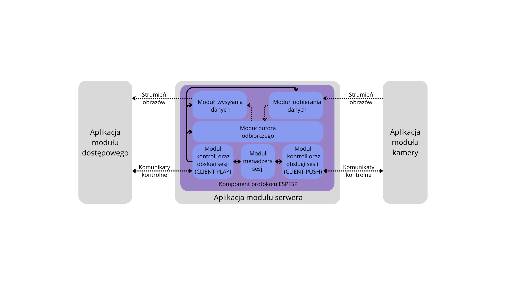

# Home Monitoring System Remote Central

## Description

This project focuses on the implementation of one of the three components of a monitoring system - server component. The system is based on the ESPFSP protocol, which facilitates hosting the camera and provides access to it through an ESPFSP protocol. The server is designed to manage communication between the camera module and client module. It acts as an intermediary that handle requests and responses, enabling clients to access and control the camera module.

Server is placed in a local network, the same as camera network. The module, based on the ESP32, acts as an intermediary in communication, connecting camera modules with the access module. The server handles network traffic management, device synchronization and configuration, and provides video stream access services for the access module.

## Functionalities

The server module is a core component of the monitoring system, facilitating communication between the camera module and client applications. Its main functionalities include:

1. Camera Handling: The server receives video streams from the camera module via the ESPFSP protocol and makes them accessible to clients.

2. Client Handling: Manages connections with client, enabling access to the video stream and configuration interfaces.

3. Relay: Allows clients to remotely adjust camera parameters and stream settings through the server.

4. Access Point (AP) Mode: The module includes an AP mode to simplify initial setup and connection to a local network, allowing users to configure Wi-Fi settings directly through the module.

## Requirements

1. Development Environment: ESP-IDF (Espressif IoT Development Framework) must be installed and configured on your system.

2. ESPFSP Project: The central project relies on the ESPFSP protocol, so the corresponding ESPFSP project must be included in the build.

3. Hardware:

    - ESP32 Module with PSRAM.
    - USB Cable: Required for flashing the firmware and powering the ESP32 module.

4. Drivers: Ensure the appropriate USB-to-serial drivers for the ESP32 module (e.g., CP210x or CH340) are installed on your computer.

## Author

Maksymilian Komarnicki – [GitHub](https://github.com/makz00).

## Licencja

...
